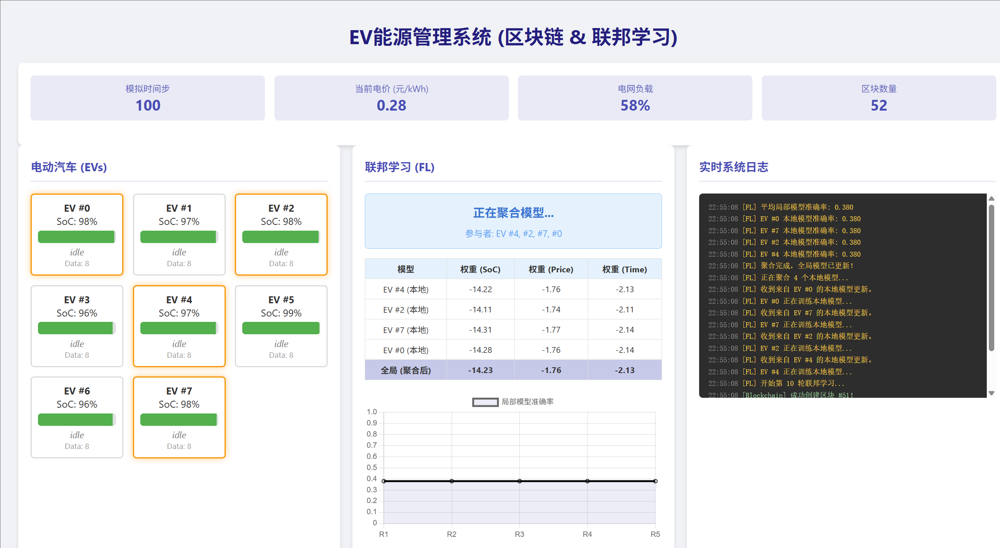
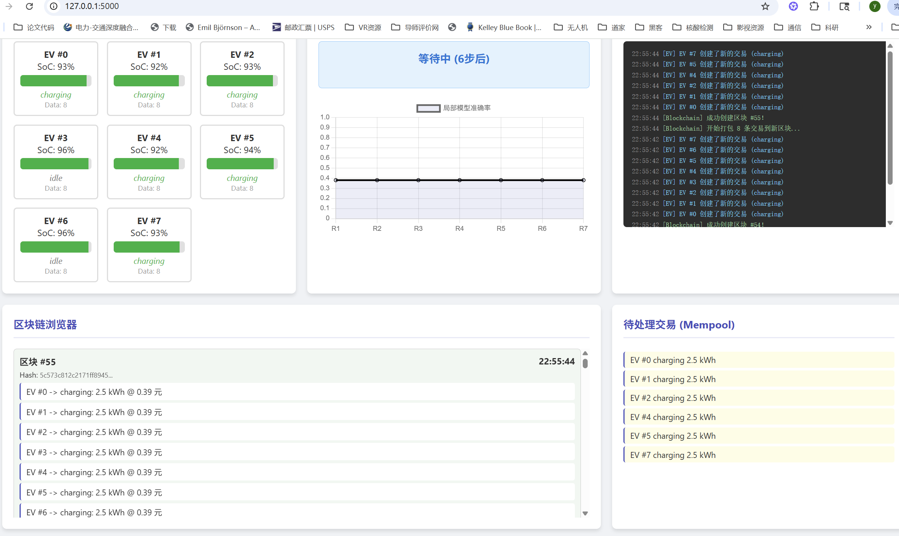

# 基于区块链与联邦学习的电动汽车能源管理系统
执行app3.py
一个模拟的电动汽车（EV）充电网络，结合了**区块链**技术用于交易记录和**联邦学习**（Federated Learning）技术用于智能决策。系统中的每辆电动汽车通过学习局部数据来优化其充放电行为，同时保护数据隐私。

## 核心功能

*   **区块链 (Blockchain):** 模拟一个去中心化的账本，用于记录所有EV的充放电交易。每10个模拟时间步长会创建一个新区块。
*   **联邦学习 (Federated Learning):** 实现了一个联邦学习框架，每隔10个模拟时间步长进行一轮模型聚合。EV在本地训练模型，仅上传模型参数，不共享原始数据。
*   **智能决策:** 使用一个全局的机器学习模型（SGD分类器）来预测EV的最优行为（充电、放电或待机），决策基于当前电量（SoC）、电网价格和时间。
*   **实时可视化:** 提供一个基于Web的实时监控界面，展示系统状态、EV信息、区块链、日志和联邦学习的训练过程。

## 技术栈

*   **后端:** Python, Flask (Web框架)
*   **机器学习:** scikit-learn (SGDClassifier, StandardScaler)
*   **数据处理:** NumPy
*   **前端:** HTML, CSS, JavaScript (Chart.js 用于绘图)
*   **核心概念:** 区块链, 联邦学习

## 安装与运行

1.  **克隆仓库**
    ```bash
    git clone https://github.com/CaoYongshengcys/blockchain_federated_learning.git
    cd blockchain_federated_learning
    ```

2.  **创建虚拟环境（推荐）**
    ```bash
    python -m venv venv
    source venv/bin/activate  # Linux/MacOS
    # 或 venv\Scripts\activate  # Windows
    ```

3.  **安装依赖**
    ```bash
    pip install flask scikit-learn numpy
    ```

4.  **运行应用**
    ```bash
    python app.py
    ```

5.  **访问系统**
    打开浏览器，访问 `http://localhost:5000`。

## 系统说明

### 1. 电动汽车 (EV) 行为
*   **状态:** 每辆EV有三种状态：`充电`、`放电`、`待机`。
*   **决策:** 决策由一个机器学习模型根据以下特征做出：
    *   当前电量 (SoC)
    *   实时电网价格
    *   一天中的时间
*   **学习:** 当EV在低价时充电或在高价时放电，它会将这些“好”的决策记录为本地训练数据。

### 2. 联邦学习 (FL) 流程
*   **频率:** 每10个模拟时间步长进行一次。
*   **参与者:** 随机选择一半的EV参与本轮训练。
*   **过程:**
    1.  参与的EV使用其本地数据训练一个模型。
    2.  所有参与者的模型参数被发送到聚合服务器。
    3.  服务器对模型参数进行平均，更新全局模型。
    4.  更新后的全局模型会分发给所有EV。
*   **监控:** 界面中的图表显示了每轮联邦学习后，参与EV的平均本地模型准确率。

### 3. 区块链 (Blockchain)
*   **交易:** 每次EV进行充放电操作时，都会生成一条交易记录。
*   **区块:** 交易首先存放在“待处理交易”池中。每10个时间步长，所有待处理的交易被打包成一个新区块并添加到区块链上。
*   **验证:** 界面会高亮显示最新生成的区块。

## 项目结构

*   `app.py`: 主程序，包含区块链、联邦学习、EV模拟和Flask Web服务器的完整实现。
*   `README.md`: 本文件。

## 如何贡献

欢迎提交Pull Request来改进此项目。您可以：
*   增加更多EV的智能行为。
*   实现更复杂的联邦学习算法（如FedAvg）。
*   添加数据库支持以持久化数据。
*   改进前端UI/UX。

## 许可证

[MIT License](LICENSE)
